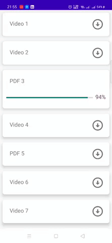
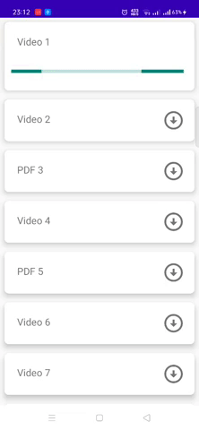
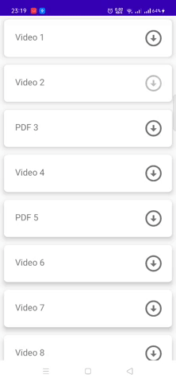

# Nagwa Assignment - Android Developer 
-----------

 Assignment Requirement: Create a simple mobile application that:

1.You can find fake responses for the list of videos and books in the attachments.
2. Or use this api (https://nagwa.free.beeceptor.com/movies)
3. You can choose one file to fake download.
4. Show fake download percentage progress for item if the item is downloading.
5. Mark the item that was downloaded, the

 Key features: 
-----------
* Show all files 
* User Can download one or multiple file 
* show progress percatage when filed downloading (if content length of file known)
* show Indeterminate in progress (if content length not exist in file like google chrome )
* show complete after file downloaded.
* handle failure when problem happened 
* Retry button to redownload file

Screenshots
-----------

| Download File state | Download File for unknown file size |Download File when failure happend | 
| --- | --- |--- |
| |  |  |

 Tech Stack
 -----------
 
 - Kotlin
- Dagger2
- Rxjava2
- OkHttp
- Android Architecture Components

 Architecture
  -----------
Clean Architecture with MVVM pattern in the presentation layer

 Ref
  -----------
  when i search to how download file i found can make it with retrofit Stream or andoid downoad manager  but i found solution from   [Jake Wharton](https://github.com/JakeWharton) that can download file with Okhttp only with progress and that link of [File](https://github.com/square/okhttp/blob/209c6c5589d7b0a0f10b4ce78ac6be0740a5cea8/samples/guide/src/main/java/okhttp3/recipes/Progress.java#L102) 
